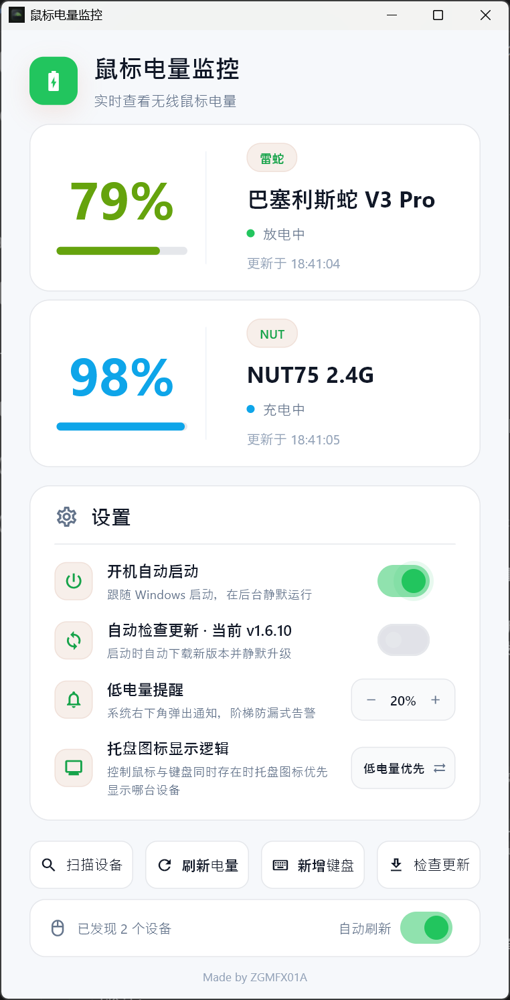

# 🔋 无线设备电量监控

[English](README.en.md) | 简体中文

Windows 托盘常驻工具，用于统一监控无线鼠标、机械键盘和标准 BLE 设备电量，并在系统托盘中快速查看状态、刷新数据和打开设置。

## ✨ 功能简介

- **托盘常驻显示**：启动后常驻系统托盘，图标可直接反映当前设备电量状态。
- **自动扫描与刷新**：自动检测已连接设备，并按固定周期刷新电量信息。
- **多品牌支持**：面向 Logitech 与 Razer 的 2.4G 无线鼠标使用场景。
- **机械键盘扩展支持**：支持华奋达（Weikav）双 8K 方案机械键盘的电量读取与绑定显示。
- **标准 BLE 电量设备**：可添加多个 Windows 已配对设备，并通过标准 Battery Service（GATT `0x180F`）读取电量；休眠设备仍会保留在候选列表中。
- **手动快速操作**：可在托盘菜单中立即刷新、打开设置窗口或退出程序。
- **低电量通知**：支持低电量提醒，避免设备突然断电影响使用。
- **设置项可持久化**：支持保存通知阈值、托盘图标显示偏好、自动更新等设置。
- **中英文界面**：可在设置界面中切换中英文显示。
- **自动更新**：可在设置界面中检查更新，并支持自动更新流程。

## 🔌 支持设备

### Bluetooth LE

支持向 Windows 公开标准 BLE Battery Service（GATT `0x180F` / `0x2A19`）的已配对设备。不支持只使用厂商私有协议或未向 Windows 暴露电量的设备。

### Razer

| 设备 | 连接方式 | 状态 |
| :--- | :--- | :--- |
| 巴塞利斯蛇 V3 Pro | 2.4G 无线 Dongle | ✅ 已验证 |
| 毒蝰 V2 Pro | 2.4G 无线 Dongle | 🔧 理论支持 |
| 毒蝰 V3 Pro | 2.4G 无线 Dongle | 🔧 理论支持 |
| 蝰蛇 V3 Hyperspeed | 2.4G 无线 Dongle | 🔧 理论支持 |

### Logitech

| 设备 | 连接方式 | 状态 |
| :--- | :--- | :--- |
| G903 / G703 | Lightspeed | 🔧 理论支持 |
| G502X | Lightspeed | 🔧 理论支持 |
| G Pro Wireless | Lightspeed | 🔧 理论支持 |

### 机械键盘

| 设备/方案 | 连接方式 | 状态 |
| :--- | :--- | :--- |
| 华奋达（Weikav）双 8K 方案机械键盘 | 2.4G 接收器 | ✅ 已支持 |

> 注意：Logitech 设备如无法读取电量，请先关闭 Logitech G Hub，避免 HID 设备被占用。
>
> 注意：机械键盘当前面向华奋达双 8K 方案接收器链路，需通过 2.4G 接收器连接后，在设置窗口中手动完成绑定。

## 🚀 快速开始

1. 前往 [Releases](../../releases) 下载最新版本的 `WirelessDeviceBatteryMonitor-<version>.exe`。
2. 双击运行程序，首次启动后会在 Windows 系统托盘中显示图标。
3. 连接受支持的 2.4G 无线鼠标、机械键盘或已配对的标准 BLE 电量设备。
4. 如果未能读取到设备，请尝试关闭相关厂商驱动占用程序，必要时再以管理员身份运行。

## 📖 如何使用

### 1. 查看电量状态

- 启动程序后，托盘图标会常驻显示。
- 鼠标悬停到托盘图标上，可查看当前设备名称、电量百分比和充电状态。

### 2. 使用托盘菜单

- **立即刷新**：手动触发一次设备扫描与电量刷新。
- **打开设置**：进入设置窗口，调整提醒阈值、语言和其他偏好。
- **退出**：关闭托盘程序。

### 3. 在设置窗口中调整选项

设置窗口主要用于：

- 调整低电量提醒阈值
- 配置托盘图标优先显示逻辑
- 切换中英文界面
- 启用或关闭自动更新
- 查看当前已识别设备的状态

### 4. 绑定机械键盘

如需启用华奋达双 8K 方案机械键盘电量显示，可按以下步骤操作：

1. 确认键盘已通过 **2.4G 接收器** 与电脑连接。
2. 打开设置窗口。
3. 点击“新增键盘”，等待程序扫描候选设备。
4. 在列表中选择对应键盘并完成绑定。
5. 绑定成功后，设置窗口会显示键盘卡片，托盘状态中也会包含键盘电量信息。

## ❓ 常见问题

### 检测不到鼠标怎么办？

1. 确认鼠标通过 **2.4G 无线接收器** 连接，当前不面向蓝牙直连场景。
2. 确认设备型号在上方支持列表中，或属于同协议系列。
3. Logitech 用户请先关闭 G Hub 后再尝试。
4. 如仍无法读取，可尝试右键以管理员身份运行。

### 为什么托盘里没有电量或显示 N/A？

- 设备可能处于休眠、刚连接完成、尚未完成首次扫描，或当前无法读取有效电量。
- 可先点击一次“立即刷新”，等待程序重新同步状态。

### 可以同时监控多台设备吗？

- 可以。程序会在托盘提示与设置窗口中展示当前识别到的设备状态。

### 机械键盘为什么需要手动绑定？

- 华奋达双 8K 方案机械键盘会暴露多个 HID 接口，程序会在“新增键盘”流程中自动筛选候选项，并绑定当前最适合读取电量的接口。

### 电量数值与官方驱动略有差异正常吗？

- 少量差异通常属于换算或刷新时间点不同导致的正常现象。

## © 版权说明

本项目版权所有，**禁止任何商业用途**，仅限个人学习与非商业使用。

未经作者明确授权，不得将本项目或其衍生版本用于以下场景：

- 商业销售
- 付费分发
- 商业集成
- 企业内部收费部署
- 其他任何直接或间接营利用途

如需商用授权，请先联系作者。
